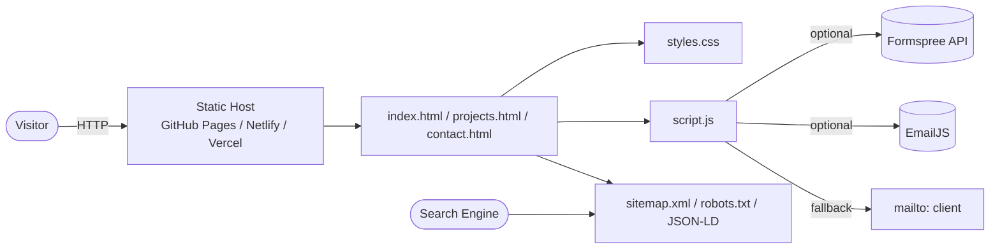

# Personal Portfolio Website — Step-by-Step Build Guide

> **Archived: original build playbook.** This document is the original roadmap used to build the project from scratch. The codebase may have evolved since this guide was written; for up-to-date setup, architecture, and deployment notes, see [../README.md](../README.md).

---

> **Project Summary:** A modern, responsive, performance-focused personal portfolio template. It consists of three pages (`index.html`, `projects.html`, `contact.html`) and includes hero/about/featured projects, a project list, and a contact form. It runs entirely on the client side; there is no backend, build tool, or framework dependency. SEO (Open Graph, Twitter Card, JSON-LD, `sitemap.xml`, `robots.txt`) and accessibility (skip link, ARIA, semantic HTML, visible focus, keyboard navigation) are first-class citizens. The contact form works with a `mailto` fallback and can optionally connect to Formspree or EmailJS.

Each step below is a self-contained prompt. Execute them in order.

Stack: HTML5, CSS3 (Custom Properties, Grid, Flexbox), Vanilla JavaScript (ES6+), no build tooling.

---

## Table of Contents

**PHASE 1 — Foundation**

- STEP 1 — Project Scaffolding & File Structure
- STEP 2 — CSS Reset, Design Tokens & Base Styles

**PHASE 2 — Shared Layout**

- STEP 3 — Header & Responsive Navigation
- STEP 4 — Footer & Global Section Primitives

**PHASE 3 — Pages**

- STEP 5 — Home Page (`index.html`)
- STEP 6 — Projects Page (`projects.html`)
- STEP 7 — Contact Page (`contact.html`)

**PHASE 4 — Interactivity**

- STEP 8 — Navigation Toggle & Active Link
- STEP 9 — Smooth Scroll & Skip-Link Focus (a11y)
- STEP 10 — Contact Form Handling & Validation
- STEP 11 — Scroll Animations & Scroll-to-Top

**PHASE 5 — SEO, A11y & Deploy**

- STEP 12 — SEO Metadata & Structured Data
- STEP 13 — `sitemap.xml` & `robots.txt`
- STEP 14 — Accessibility & Performance Pass
- STEP 15 — Deployment (GitHub Pages / Netlify / Vercel)

**Appendices**

- Appendix A — Design Tokens (CSS Variables)
- Appendix B — Responsive Breakpoints
- Appendix C — Common Pitfalls
- Appendix D — Pre-flight Checklist

---

## Global Build Rules (apply to EVERY step)

- **No git operations.** Do not run `git` commands; version control is managed manually by the user.
- Do not add unapproved packages; use native browser APIs as much as possible.
- Do not start long-running processes (watchers, servers) unless requested.
- Each step is independent; when implementing a step, only touch that step's files.
- Code must be clean and readable; variable/function names must be in English and camelCase.
- Security, accessibility, and performance are considered at every step; follow the DRY principle.

---

## Architecture at a Glance

Because this is a static site, the "architecture" is the relationship between the assets loaded in the browser. There is no server-side logic; the contact form is routed to external services (optional) or the user's email client.



All pages share the same `styles.css` and `script.js` files. `script.js` is written defensively so that it runs safely on every page (elements may be `null`).

---

# PHASE 1 — FOUNDATION

---

## STEP 1 — Project Scaffolding & File Structure

**Goal:** Set up the dependency-free static project skeleton that opens directly in the browser.

**Files/folders to create:**

```
.
├── index.html
├── projects.html
├── contact.html
├── styles.css
├── script.js
├── sitemap.xml
├── robots.txt
├── .gitignore
└── assets/            # profile image, project images, cv.pdf, favicon
```

**Implementation notes:**

- No build tool or `package.json`; the site files are served to the browser as-is.
- A static server is enough for development: `python -m http.server 8000` or VS Code Live Server.
- The `assets/` folder is reserved for images, the CV, and the favicon; the template uses CSS placeholders when no image is present.

**Acceptance:** `index.html` opens in the browser without errors even when empty; the console is clean.

---

## STEP 2 — CSS Reset, Design Tokens & Base Styles

**Goal:** Define a reset, CSS variables, and typography for a consistent design foundation.

**Files to edit:** `styles.css`

**Implementation notes:**

- Universal reset: `* { margin:0; padding:0; box-sizing:border-box; }`.
- Define all colors, shadows, and transitions as CSS custom properties under `:root` (see Appendix A). This enables single-point, brand-based customization (DRY).
- `html { scroll-behavior: smooth; }` and a system font stack for fast, FOUT-free typography.
- `.container` standardizes the max width (1200px) and horizontal padding.

**Acceptance:** Colors/spacing come from variables; there is no repeated hard-coded color.

---

# PHASE 2 — SHARED LAYOUT

---

## STEP 3 — Header & Responsive Navigation

**Goal:** Build the sticky header and mobile hamburger menu shared across the three pages.

**Files to edit:** the `<header>` block of each HTML file, `styles.css`

**Implementation notes:**

- `.header` stays above the content with sticky + `z-index`.
- `.nav-menu` is flex on desktop; below `max-width: 768px` it becomes an off-canvas panel and `.nav-toggle` becomes visible.
- The three `<span>` lines of `.nav-toggle` turn into an X in the `.active` state.
- Give the active page link `class="active"` (underline indicator via `::after`).

**A11y:** `.nav-toggle` carries `aria-label="Toggle navigation"`; all links have a visible `:focus` outline.

**Acceptance:** The menu turns into a hamburger below 768px; it is keyboard-navigable.

---

## STEP 4 — Footer & Global Section Primitives

**Goal:** Define the shared footer and reusable section/heading/button classes.

**Files to edit:** each HTML `<footer>`, `styles.css`

**Implementation notes:**

- `.footer` dark background + social links; `.footer-content` is flex and stacks vertically on mobile.
- Reusable primitives: `.btn`, `.btn-primary`, `.btn-secondary`, `.btn-outline`, `.section-title`, `.page-title`, `.page-subtitle`.
- `:hover` and `:focus` states are mandatory on buttons (a11y + UX).

**Acceptance:** Button and heading styles are consistent across all pages from a single definition.

---

# PHASE 3 — PAGES

---

## STEP 5 — Home Page (`index.html`)

**Goal:** Build the Hero, About, and Featured Projects sections.

**Files to edit:** `index.html`, `styles.css`

**Implementation notes:**

- Hero: two-column grid (text + circular profile placeholder), CTA buttons (Download CV, Contact).
- About: text + `.skills-grid` (technology tags).
- Featured projects: 2 `.project-card` items inside `.projects-preview`, with a "View All Projects" CTA.
- Until images are added, `.profile-placeholder` and `.image-placeholder` gradient boxes are used; the real `` example with `loading="lazy"` is left as a comment.

**Acceptance:** The hero collapses to a single column below 968px; placeholders look correct.

---

## STEP 6 — Projects Page (`projects.html`)

**Goal:** List all projects with detailed cards.

**Files to edit:** `projects.html`, `styles.css`

**Implementation notes:**

- `.projects-grid` is a vertical stack; each item is `.project-card-large` (image + info grid).
- Each card: title, description, `.project-tech` tags, `.project-links` (Demo + GitHub).
- External links carry `target="_blank" rel="noopener noreferrer"` (security).
- Cards collapse to a single column below 968px.

**Acceptance:** Cards are responsive; all external links contain `rel="noopener noreferrer"`.

---

## STEP 7 — Contact Page (`contact.html`)

**Goal:** Build the contact information + an accessible contact form.

**Files to edit:** `contact.html`, `styles.css`

**Implementation notes:**

- Two columns: `.contact-info` (email, LinkedIn, GitHub, location) and `.contact-form-wrapper`.
- Form fields: `name`, `email`, `subject`, `message`; each with a `<label for>` + `required`.
- The `#formMessage` box is for success/error messages (`.success` / `.error` classes).
- Inputs get a visible outline + box-shadow on `:focus`.

**Acceptance:** Every input has an associated label; the form is a single column below 968px.

---

# PHASE 4 — INTERACTIVITY

---

## STEP 8 — Navigation Toggle & Active Link

**Goal:** Toggle the mobile menu and highlight the current page link.

**Files to edit:** `script.js`

**Implementation notes:**

- On `navToggle` click, toggle `.active` on `navMenu` and `navToggle`.
- Close the menu when a link is clicked (mobile UX).
- Find the current page with `window.location.pathname` and add `.active` to the matching link.
- If the elements don't exist, the code should silently skip (`if (navToggle && navMenu)`).

**Acceptance:** The menu opens on mobile and closes when a link is clicked; the active link is correct.

---

## STEP 9 — Smooth Scroll & Skip-Link Focus (a11y)

**Goal:** Smooth scrolling on anchor links; making the skip link work with screen readers.

**Files to edit:** `script.js`

**Implementation notes:**

- For `a[href^="#"]` links: skip those that are `href === '#'` (placeholder demo/GitHub buttons) so the page doesn't jump to the top.
- If the target is not found, do not call `preventDefault`; preserve the default behavior.
- After scrolling, move keyboard focus to the target (`tabindex="-1"` + `focus({ preventScroll: true })`) so the "Skip to main content" link actually works.

```javascript
document.querySelectorAll('a[href^="#"]').forEach(anchor => {
  anchor.addEventListener('click', function (e) {
    const href = this.getAttribute('href');
    if (href === '#') return;
    const target = document.querySelector(href);
    if (!target) return;
    e.preventDefault();
    target.scrollIntoView({ behavior: 'smooth', block: 'start' });
    target.setAttribute('tabindex', '-1');
    target.focus({ preventScroll: true });
  });
});
```

**Acceptance:** The skip link moves focus to `#main-content`; `href="#"` buttons don't make the page jump.

---

## STEP 10 — Contact Form Handling & Validation

**Goal:** Client-side validation + submission strategy.

**Files to edit:** `script.js`

**Implementation notes:**

- On the `submit` event, call `preventDefault`; read the fields with `FormData`.
- Validate empty fields and the email via regex; on error, show `#formMessage`.
- Three options for submission: Formspree (`fetch`), EmailJS, or the default `mailto` fallback.
- The `showFormMessage(message, type)` helper function manages the message box (DRY).

**Security:** User input is escaped into the `mailto` link with `encodeURIComponent`; sensitive keys must not be embedded in the client.

**Acceptance:** An invalid email shows an error message; a valid submission is routed to the selected channel.

---

## STEP 11 — Scroll Animations & Scroll-to-Top

**Goal:** Fade-in animations and a scroll-to-top button.

**Files to edit:** `script.js`, `styles.css`

**Implementation notes:**

- Use `IntersectionObserver` to fade in `.project-card`, `.project-card-large`, `.about-content`, and `.contact-wrapper` elements as they become visible.
- The scroll-to-top button is created with JS, but its **styles are kept in `styles.css`** in the `.scroll-to-top` and `.scroll-to-top.visible` classes (no inline styles — DRY/clean code).
- The scroll listener is throttled with `debounce` (performance).

```javascript
const handleScroll = debounce(() => {
  scrollToTopBtn.classList.toggle('visible', window.pageYOffset > 300);
}, 100);
```

**Acceptance:** The button appears after 300px; scroll performance is smooth.

---

# PHASE 5 — SEO, A11Y & DEPLOY

---

## STEP 12 — SEO Metadata & Structured Data

**Goal:** Add a full SEO meta set and JSON-LD to each page.

**Files to edit:** the `<head>` block of the three HTML files

**Implementation notes:**

- `description`, `keywords`, `author`, canonical link.
- Open Graph (`og:*`) and Twitter Card (`twitter:*`) tags.
- JSON-LD: `Person` on the home page, `CollectionPage` on projects, `ContactPage` on contact.
- Before going live, replace the `yourwebsite.com`, `Your Name`, and `email@example.com` placeholders with real values.

**Acceptance:** Each page has valid JSON-LD and a canonical URL.

---

## STEP 13 — `sitemap.xml` & `robots.txt`

**Goal:** Sitemap and robots files for search engine crawling.

**Files to edit:** `sitemap.xml`, `robots.txt`

**Implementation notes:**

- `sitemap.xml`: three URLs, `lastmod`, `changefreq`, `priority`.
- `robots.txt`: allow all bots + a sitemap reference.
- Update the domain placeholders with the real domain.

**Acceptance:** `sitemap.xml` is valid XML; `robots.txt` points to the sitemap.

---

## STEP 14 — Accessibility & Performance Pass

**Goal:** WCAG compliance and speed improvements.

**Implementation notes:**

- The skip link (`.skip-link`) becomes visible on `:focus` and is the first focusable element.
- Visible `:focus` on all interactive elements; `alt` and `loading="lazy"` for images.
- Verify color contrast at the WCAG 2.1 AA level.
- Use `opacity`/`transform` for animations to avoid unnecessary reflows.

**Acceptance:** Keyboard-only navigation covers the entire flow; the Lighthouse a11y score is high.

---

## STEP 15 — Deployment (GitHub Pages / Netlify / Vercel)

**Goal:** Publish the static site.

**Implementation notes:**

- **GitHub Pages:** repo Settings > Pages > `main` branch root.
- **Netlify:** "New site from Git", empty build command, publish dir `/`.
- **Vercel:** "New Project", framework preset "Other".
- No build step; the files are served as-is.

**Acceptance:** All three pages return 200 in the live environment; assets (CSS/JS) load.

---

# Appendix A — Design Tokens (CSS Variables)

Design variables managed from a single source under `:root`:

```css
:root {
  --primary-color: #2563eb;
  --primary-dark: #1e40af;
  --secondary-color: #64748b;
  --text-color: #1e293b;
  --text-light: #64748b;
  --bg-color: #ffffff;
  --bg-light: #f8fafc;
  --bg-dark: #0f172a;
  --border-color: #e2e8f0;
  --shadow-sm: 0 1px 2px 0 rgba(0, 0, 0, 0.05);
  --shadow-md: 0 4px 6px -1px rgba(0, 0, 0, 0.1);
  --shadow-lg: 0 10px 15px -3px rgba(0, 0, 0, 0.1);
  --transition: all 0.3s ease;
}
```

---

# Appendix B — Responsive Breakpoints

| Breakpoint          | Target                                              |
| ------------------- | --------------------------------------------------- |
| `max-width: 968px`  | Hero/about/projects/contact grids collapse to one column |
| `max-width: 768px`  | Hamburger menu, off-canvas nav, heading scale       |
| `max-width: 480px`  | Container padding, button scale, vertical footer    |

---

# Appendix C — Common Pitfalls

- **Skip-link focus:** `scrollIntoView` alone is not enough; without calling `focus()`, the skip link does not work for screen reader users.
- **`href="#"` buttons:** The generic `a[href^="#"]` smooth-scroll handler can make the page jump to the top via `preventDefault`; bare `#` links must be skipped.
- **Inline styles:** Don't embed the style of JS-created elements like scroll-to-top inside JS; use a CSS class (DRY, maintainability).
- **Placeholder content:** The template contains values like `yourwebsite.com`, `Your Name`, and `email@example.com`; replace them before going live.
- **Missing `assets/`:** References to `cv.pdf`, the favicon, and the OG image return 404 if the files don't exist.
- **External links:** `target="_blank"` must always be used together with `rel="noopener noreferrer"`.

---

# Appendix D — Pre-flight Checklist

- [ ] All placeholder text/URLs/emails replaced with real values
- [ ] Images, favicon, and `cv.pdf` present in `assets/`
- [ ] JSON-LD, OG, and Twitter meta tags correct on every page
- [ ] `sitemap.xml` and `robots.txt` point to the real domain
- [ ] Keyboard-only navigation and the skip link work
- [ ] All external links carry `rel="noopener noreferrer"`
- [ ] Mobile (≤768px) menu and responsive grids verified
- [ ] Console is error-free; Lighthouse SEO/A11y/Performance scores are green
